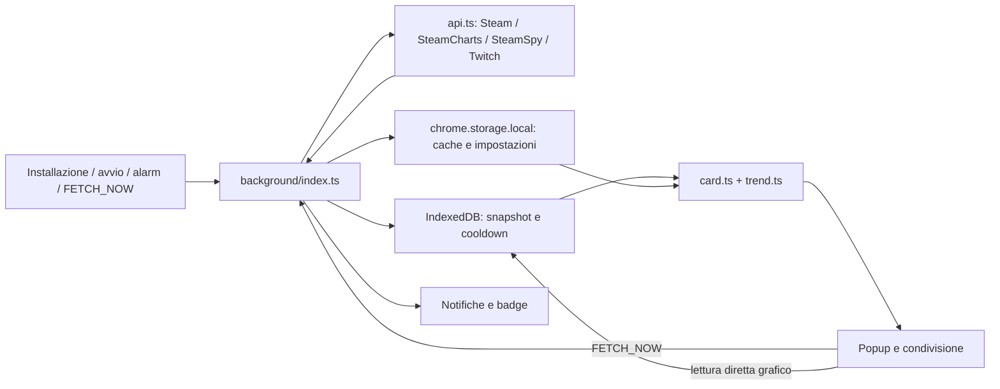

# SteamWatch: analisi e piano d’azione

Data: 11 settembre 2026. Versione esaminata: 0.14.7. Codice applicativo invariato rispetto a `b4ec769`; configurazione vexp pubblicata con `79540c4`, artefatti Sisyphus esclusi dal versionamento con `e211c77`.

Stato: audit tecnico e proposta dettagliata. La fase 1 è stata autorizzata e implementata; vedere [risultati e verifiche](phase-1-results.md). La fase 2 è stata autorizzata dopo il feedback sui grafici e implementata nella beta 2; vedere [risultati e verifica delle fonti](phase-2-results.md). La fase 3 è stata autorizzata e implementata nella beta 3; vedere [risultati e verifiche](phase-3-results.md). Le implementazioni delle fasi 4–7 proseguono nella beta 5; vedere [risultati e limiti](phase-4-7-results.md). Le scelte di prodotto sono in discussione tramite grill-with-docs; nessuna proposta numerica qui sotto è una decisione già approvata. Le sezioni di audit descrivono la versione prima delle correzioni.

Aggiornamento beta 4: corretto il recupero manuale degli import falliti segnalato su Black Flag; vedere [diagnosi e verifica](black-flag-recovery.md). La successiva beta 5 affronta trend, notifiche, coerenza e prestazioni.

## 1. Valutazione

La struttura di base è adatta a un’estensione piccola: TypeScript, UI vanilla, service worker, IndexedDB per la serie temporale e funzioni di calcolo separate. Non serve riscriverla con un framework né introdurre microservizi per ripulirla.

Il problema principale è il contratto dei dati: osservazioni istantanee, valori recuperati da cache, aggregati storici, picchi e trend vengono trattati come se avessero la stessa copertura e freschezza. Questo rende possibile una schermata numericamente plausibile ma semanticamente sbagliata. Migliorare soltanto la grafica o le soglie non risolve il problema.

L’attuale “trend” misura la differenza fra due porzioni della serie: non distingue il normale ciclo giornaliero dalla perdita persistente di attività. Inoltre, dai soli giocatori contemporanei non si può dedurre il churn dei singoli utenti o la causa “organica” di un calo. Il risultato corretto è una variazione persistente dell’attività osservata, corretta per i pattern ricorrenti e accompagnata dalla qualità del dato.

## 2. Verifiche eseguite e limiti

| Verifica | Esito |
| --- | --- |
| `pnpm run build` | PASS; versione rimasta 0.14.7 |
| `pnpm test` | PASS: 306 test, 14 file |
| `pnpm exec tsc --noEmit` | FAIL: 12 diagnostiche tra sorgenti e mock dei test |
| Curva giornaliera sintetica senza declino | `computeTrend` restituisce −48,3%, `STRONG_DOWN` |
| Sei campioni quasi solo agli estremi di 24 ore | `compute24hAvg` restituisce 9909, nonostante un buco di circa 23 ore |
| Risposta AppDetails valida con chiave `570` | `fetchAppDetails` restituisce `null` |
| Accesso allo storico SteamCharts e documentazione API SteamSpy | Non verificato: strumento web e successiva estrazione ultimate-browsing non hanno ottenuto contenuto valido |
| Estensione caricata in Chrome, confronto pixel e notifiche native | Non eseguiti in questo audit; richiesti nel collaudo del piano |

Il primo comando di build ha attivato l’installazione automatica delle dipendenze, interrotta per script di dipendenze non approvati. Il secondo tentativo ha eseguito correttamente build e test con le dipendenze installate, senza modificare le policy. Il file `pnpm-workspace.yaml` generato dal tentativo, contenente soltanto placeholder, è stato rimosso.

Il grafo codebase-memory non contiene questo repository; la discovery ha usato vexp e lettura dei sorgenti. I risultati statici indicano difetti o rischi dimostrabili dal flusso del codice, non misure di prestazioni in Chrome.

### Riproduzioni numeriche

Per il ciclo fisiologico sono stati creati 288 campioni ogni cinque minuti nelle ultime 24 ore con `current = round(10000 + 5000 * sin(2πi/288))`. È un periodo di una curva ripetibile identica ogni giorno. Il confronto fra le due metà produce −48,3%: la periodicità viene scambiata per declino.

Per la copertura sono stati usati soltanto gli indici 0, 1, 2, 284, 285 e 287 della stessa curva. La distanza fra primo e ultimo campione soddisfa il controllo esistente, pur non descrivendo quasi tutta la giornata.

## 3. Architettura attuale

Da conservare: assenza di framework, confine API, helper DOM sicuri, funzioni di calcolo testabili, ViewModel condiviso con la condivisione, separazione fra impostazioni e serie temporali.

Da cambiare: `background/index.ts` concentra schedulazione, importazione, richieste, persistenza, notifiche e badge. `fetchCycle.ts` contiene soprattutto merge della cache, non il coordinamento del ciclo. Il popup legge una fotografia dei dati e poi rilegge autonomamente IndexedDB per il grafico: due momenti diversi possono produrre dettagli incoerenti.

## 4. Riscontri prioritari

| ID | Priorità | Evidenza | Conseguenza |
| --- | --- | --- | --- |
| D1 | Alta | `src/utils/trend.ts:37`: confronto medie delle due metà; fallback anche a dati fuori dalle ultime 24 ore | Falso declino notturno; storico vecchio può diventare segnale attuale |
| D2 | Alta | `src/background/index.ts:157`: sentinel bootstrap scritto prima del download, durata dieci anni | Primo tentativo offline/vuoto fallito impedisce tentativi successivi ordinari |
| D3 | Alta | `src/popup/main.ts:56` e `:482`: refresh condizionato a metadati mancanti, non all’età; `current == null` esclude hydration | Aprire il popup non garantisce aggiornamento; una cache vuota può restare senza dati |
| D4 | Alta | `src/background/fetchCycle.ts:31`: fallback dei singoli campi con un solo nuovo `fetchedAt`; `background/index.ts:141` aggiorna il tempo globale | Twitch e picchi obsoleti possono sembrare recenti; un ciclo senza dati validi appare aggiornato |
| D5 | Alta | `src/utils/compaction.ts:62`: lettura, cancellazione di tutti gli snapshot, reinserimenti separati | Interruzione o concorrenza può perdere dati; UI può leggere serie vuote o parziali |
| D6 | Alta | `src/utils/trend.ts:200`: almeno sei punti e span del 95%; `sparkline.ts:140` circa: span del 75% | Copertura temporale apparente senza controllo dei buchi; media e filtri ingannevoli |
| D7 | Alta | `src/utils/api.ts:50`: `z.object({ [z.string()]: ... })` | Non è uno schema di record con chiavi dinamiche; risposta AppDetails valida scartata, riprodotto |
| D8 | Alta | `src/background/index.ts:108`: nessuna deduplicazione dei cicli o limite temporale delle richieste | Alarm, refresh e cambio preferito possono sovrapporsi; risultati più vecchi possono sovrascrivere quelli nuovi |
| D9 | Alta | `src/background/index.ts:267`: assoluta solo `current >= abs`; `:247` ritorno anticipato; `notify` può non inviare | Soglia ripetuta dopo cooldown, non attraversamento; assoluta può impedire di valutare trend anche se non notificata |
| D10 | Media | `src/utils/sparkline.ts:17`: X dipende dall’indice; sottocampionamento uniforme | Un’ora e un giorno di distanza possono occupare lo stesso spazio; picchi intermedi possono sparire |
| D11 | Media | `src/utils/card.ts:52`, `background/fetchCycle.ts:44` | Picco locale ingloba valori esterni; un massimo osservato localmente può essere etichettato come record assoluto |
| D12 | Media | `src/utils/trend.ts:156`: zeri eliminati dal minimo se esistono valori positivi | Un gioco realmente a zero non viene rappresentato correttamente |
| D13 | Media | `src/popup/main.ts:413`: cambio periodo aggiorna grafico e minimo; statistiche create a `:365` restano fisse | Ambiguità fra periodo del grafico e metriche; letture asincrone possono terminare fuori ordine |
| D14 | Media | `src/popup/main.ts:85` seguito da `showState` a `:784` | La barra appena aggiornata viene nuovamente nascosta |
| D15 | Media | `src/popup/main.ts:727`: cambio preferito richiede fetch completo; assenza di sincronizzazione della vista aperta | Badge attende fonti estranee al suo dato; popup non riflette automaticamente i cicli in background |
| D16 | Media | `src/utils/compaction.ts:26`: aggregati conservati come normali `Snapshot` | Medie di medie senza pesi e granularità non riconoscibile; perdita di estremi e informazione di copertura |
| D17 | Media | `src/utils/storage.ts:45`, `:156`, `:172`: letture tipizzate senza validazione runtime | Cache o impostazioni malformate possono raggiungere UI e notifiche; la normalizzazione globale non copre tutte le entità |
| D18 | Media | `src/utils/storage.ts:75`: rimozione in più passaggi, senza eliminare sentinel bootstrap e preferito | Riaggiungere il gioco può lasciare storico vuoto senza backfill e ripristinare un vecchio preferito |
| D19 | Media | `src/popup/main.ts:482`: Twitch nullo interpretato come dato da recuperare | Categoria inesistente può provocare fetch di tutti i giochi a ogni apertura |
| D20 | Media | `background/index.ts:223` rispetto a `:248` e `trend.ts:14` | Colore badge, livello della card e soglie di notifica applicano regole differenti senza spiegazione |

Le posizioni indicate sono punti di ingresso nel codice auditato; i test da introdurre devono coprire gli scenari descritti, non soltanto fissare l’output corrente.

### Controllo TypeScript

Sorgenti: `src/popup/main.ts:504` assegna `undefined` a una proprietà opzionale con `exactOptionalPropertyTypes`; `src/utils/api.ts:51` e `:111` usano in modo errato lo schema AppDetails. Test: `tests/api.test.ts:246` e `:247`; `tests/background-bootstrap.test.ts:81`, `:82`, `:83`, `:84`, `:86`, `:87`, `:88`. Vite produce il bundle anche quando il typecheck fallisce: serve un gate esplicito.

## 5. Contratto dei dati proposto

| Dato mostrato | Significato e regola |
| --- | --- |
| Giocatori Steam adesso | Ultima osservazione valida dei giocatori contemporanei, con fonte e ora; non utenti unici |
| Spettatori Twitch | Metrica distinta per categoria Twitch; non sommare ai giocatori Steam |
| Picco nelle 24 ore | Massimo nel periodo, con copertura e fonte; un picco esterno senza timestamp proprio non è automaticamente fresco |
| Record storico | Record della fonte dichiarata; se esiste soltanto storico locale, etichettare “massimo osservato” |
| Minimo del periodo | Minimo valido, incluso zero; errore di rete è assenza, non zero |
| Media del periodo | Media su intervalli comparabili, pesata per durata osservata; niente interpolazione attraverso grandi buchi |
| Variazione puntuale | Differenza fra due osservazioni comparabili, con intervallo esplicito |
| Trend strutturale | Cambiamento persistente rispetto al comportamento atteso per quel gioco, con qualità sufficiente |
| Nessun trend disponibile | Stato esplicito per copertura insufficiente o dati obsoleti; non “stabile” |
| All | Tutto lo storico effettivamente disponibile, non tutta la vita del gioco |

Ogni metrica deve avere valore nullable, fonte, timestamp di osservazione quando disponibile, timestamp di acquisizione, stato e copertura. Se la fonte non dichiara l’ora di osservazione, conservarlo come limite: il momento del download non la sostituisce.

Separare campioni grezzi e aggregati. Gli aggregati richiedono almeno intervallo, somma/peso o integrale/durata osservata, numero di campioni, minimo/massimo con timestamp e provenienza. Le analisi non devono confondere campioni a cinque minuti, medie giornaliere e medie settimanali.

## 6. Fattibilità delle fonti

Steam documenta `GetNumberOfCurrentPlayers` come conteggio degli utenti attivi nell’app collegati a Steam, non uno storico completo né un conteggio di spettatori. [Steamworks](https://partner.steamgames.com/doc/webapi/ISteamUserStats?l=english).

Gli alarm di Chrome non svegliano il dispositivo; al risveglio un alarm ripetuto scaduto viene eseguito al massimo una volta. Il campionamento locale ha quindi buchi inevitabili durante sospensione o indisponibilità del browser. [Chrome alarms](https://developer.chrome.com/docs/extensions/reference/api/alarms).

Il codice tenta un bootstrap da `steamcharts.com/app/{appid}/chart-data.json`. In questa analisi non è stato possibile verificarne disponibilità, risoluzione o copertura. Prima di promettere tutti i filtri popolati al primo avvio, una prova deve verificare risposte reali per giochi popolari, piccoli, recenti e senza storico. Non inventare campioni per riempire le finestre.

Twitch viene interrogato mediante GraphQL e un Client-ID del web client. La strada pubblicamente documentata usa Helix, identificativi di categoria, autenticazione e paginazione degli stream. L’eventuale totale dei viewer va raccolto con deduplicazione e dichiarando che le pagine non sono una fotografia atomica. [Twitch API](https://dev.twitch.tv/docs/api/reference/#get-streams). Scegliere la soluzione dopo aver definito il peso di Twitch e i vincoli su backend/autenticazione.

Il significato di `SteamSpy.peak_ccu` non è stato verificato tramite documentazione primaria accessibile in questa sessione: non assumerlo un record storico globale perché il commento del codice lo chiama così.

Tre opzioni da confrontare: raccolta locale con storico parziale onesto; backend con raccolta continuativa; provider di storico verificato. Un backend iniziato oggi non recupera da solo lo storico precedente e non fa apparire notifiche native su un computer spento.

## 7. Proposta per il trend

### Primo modello: confronto stagionale interpretabile

1. Creare intervalli orari in UTC, preservando validità, densità e durata osservata. UTC è riferimento comune per una popolazione globale, non il fuso dell’utente; cambi stagionali del pubblico restano possibili.
2. Confrontare ogni intervallo recente con le stesse ore degli stessi giorni della settimana nelle settimane precedenti. Proposta iniziale: mediana di quattro settimane precedenti, senza usare campioni futuri.
3. Confrontare il livello recente con quello atteso sugli stessi intervalli validi. Formula illustrativa: `100 * (sum(recentComparable) / sum(expectedComparable) - 1)`; le finestre devono avere identico peso temporale. Gestire esplicitamente denominatore zero o troppo piccolo.
4. Per il trend strutturale usare una finestra recente sufficientemente lunga, proposta 7 giorni. Per variazioni improvvise usare un segnale distinto, proposta 24 ore: non chiamare entrambi semplicemente “trend”.
5. Richiedere copertura distribuita nella settimana, non soltanto tanti campioni: proposta ≥80% di intervalli validi e almeno tre confronti storici per intervallo. Sono valori da calibrare, non garanzie statistiche.
6. Sotto copertura minima: “storico insufficiente”; eventuale confronto con la settimana precedente va etichettato come provvisorio, senza notifiche strutturali.
7. Notificare soltanto uno scostamento abbastanza grande, persistente e significativo in numero assoluto, con isteresi e riarmo. La sensibilità dipende dalla scala e dalla variabilità del gioco.
8. Registrare qualità, finestre e versione dell’algoritmo nel risultato. Evitare percentuali di “confidenza” non calibrate.

Quattro settimane di baseline più sette giorni recenti richiedono fino a cinque settimane di copertura utilizzabile: 60 giorni nominali di retention possono bastare, ma 60 giorni con Chrome acceso soltanto la sera no.

La baseline deve adattarsi senza cancellare rapidamente un declino persistente. Valutare in backtest quanto tempo il segnale resta visibile dopo un cambiamento di livello; il riarmo della notifica non deve dipendere soltanto dal riassorbimento nella baseline.

### Alternativa da confrontare, non requisito automatico

Decomposizione stagionale robusta con componenti giornaliera e settimanale e stima del livello depurato. Può gestire pattern più complessi ma aggiunge costi di calibrazione, trattamento dei buchi e spiegabilità. Confrontarla con il modello semplice soltanto se migliora gli errori osservati. La separazione fra stagionalità, trend e residuo è trattata dagli autori di [Forecasting: Principles and Practice](https://otexts.com/fpp3/stl.html); la stagionalità multipla richiede attenzione specifica, non l’applicazione ingenua di un solo periodo. [Complex seasonality](https://otexts.com/fpp3/complexseasonality.html).

Nessun modello deduce da solo se il calo è causato da abbandono, fine di un evento, vacanze, patch o problemi dei server. La UI deve descrivere l’attività, non attribuire cause non osservate.

### Validazione del modello

Dataset sintetici: ciclo giorno/notte puro; weekend diversi dai feriali; rumore; crescita e declino graduali; calo permanente del 20%; evento di un giorno seguito da ritorno alla norma; nuovo gioco; numeri bassi; zero reale; buchi concentrati nelle ore notturne; cambio di fonte e granularità.

Replay cronologico su serie reali con copertura verificata: nessun dato futuro nella baseline. Misurare falsi allarmi per gioco/settimana, ritardo di rilevamento, precisione sui cambiamenti annotati, stabilità delle etichette e quota di tempo senza copertura sufficiente. Separare dataset di calibrazione e valutazione. Concordare i target prima di scegliere soglie definitive.

## 8. Architettura obiettivo e piano ordinato

### Fase 0 — Definizioni e contratto delle fonti

Risolvere Q1–Q3 e poi latenza attesa, finestre prioritarie e sensibilità. Documentare glossario in `CONTEXT.md` appena i termini sono concordati. Creare ADR solo per scelte costose da invertire, ad esempio backend/provider e formato persistito; non per ogni estrazione di funzione.

Produrre fixture reali datate dei provider e matrice: autenticazione, copertura, granularità, timestamp, quote, errori, possibilità effettiva di backfill. Criterio di uscita: promessa di prodotto compatibile con le fonti verificate.

### Fase 1 — Gate di qualità e correzioni indipendenti

File: `package.json`, `src/utils/api.ts`, `src/popup/main.ts`, relativi test.

Correggere tutti gli errori TypeScript, usare lo schema corretto per record dinamici, introdurre typecheck esplicito nel percorso di verifica. Aggiungere regressione AppDetails valida e casi mancanti/malformati; aggiornare mock senza soppressioni. Correggere barra di aggiornamento nascosta e gestione della risposta `{ok:false}` del worker.

Validare anche giochi, cache e impostazioni persistite al confine storage, con recupero controllato dei dati invalidi. Aggiungere casi di impostazioni per gioco malformate e orari quiet hours non validi.

Accettazione: build, typecheck e test tutti verdi; risposta valida restituisce nome/immagine; stato errore effettivamente visibile. Nessuna variazione di versione fino a rilascio.

### Fase 2 — Persistenza e importazione affidabili

File: `src/types/index.ts`, `src/utils/idb-storage.ts`, `src/utils/compaction.ts`, `src/utils/migrate.ts`, bootstrap oggi in `background/index.ts`.

Separare metadati di bootstrap dai cooldown; stati tentato/in corso/completato/fallito con retry e backoff. Completamento solo dopo commit riuscito e verifica di copertura. Importazione idempotente e deduplicata; conservare fonte/granularità, respingere timestamp futuri e conteggi invalidi.

Compattazione atomica per intervallo in una transazione, con protezione dalle scritture concorrenti e senza cancellazione globale seguita da reinserimenti individuali. Preservare minimi, massimi, pesi e copertura. Pianificare migrazione conservativa: i vecchi record senza provenienza rimangono di qualità sconosciuta e non abilitano alert affidabili da soli.

Rimozione del gioco come operazione riconciliabile fra i due storage: eliminare anche stato bootstrap, regole/cooldown e riferimento del preferito. Testare rimozione parziale, ripresa della pulizia e successiva aggiunta. Il backfill abilita le notifiche solo se provenienza, granularità e qualità soddisfano lo stesso contratto dei dati live; un array importato non basta.

Accettazione: interruzione non perde storico; ripetere import/compaction non altera risultati; campione live concorrente conservato; serie leggibile durante manutenzione.

### Fase 3 — Ciclo di refresh unico e dati freschi

File: `background/index.ts`, `background/fetchCycle.ts`, `utils/api.ts`, `utils/storage.ts`, `types/index.ts`.

Spostare il coordinamento in un modulo dedicato; lasciare nell’entry point registrazione degli eventi. Un solo ciclo attivo condiviso fra richiedenti, con protezione da risultati fuori ordine. Timeout per fonte, limiti di concorrenza per provider, retry limitati e backoff per errori temporanei.

Separare tre lavori: conteggio live, metadati a TTL più lungo, backfill storico. Rendere disponibile il live senza aspettare Twitch, SteamSpy o tutto lo storico. Conservare timestamp e stato separati per campo; distinguere ultimo tentativo da ultimo successo. Aggiornare solo giochi ancora presenti.

Proposta di prodotto da confermare: cache subito visibile; aggiornamento all’apertura se oltre 60 secondi; polling live ogni 60 secondi a popup visibile e 5 minuti in background, compatibilmente con quote e scheduler. Nessun download dell’intero storico a ogni apertura: integrare soltanto ciò che manca.

Accettazione: aprire/refresh/alarm simultanei produce un ciclo condiviso; una fonte bloccata non congela tutte le card; fallimento non rinnova l’età del valore; nessun campione falso durante offline.

### Fase 4 — Metriche e trend

File: `utils/trend.ts`, `utils/card.ts`, `types/index.ts`; moduli separati solo per normalizzazione della serie e risultato analitico quando servono.

Implementare il contratto della sezione 5 e il modello selezionato dopo backtest. Passare esplicitamente `now` ai calcoli per renderli riproducibili. Distinguere massimo osservato e record della fonte. Eliminare il fallback che presenta la variazione di due punti come trend affidabile.

Accettazione: cicli fisiologici non generano declino strutturale; dati insufficienti non diventano “stabile”; zero reale preservato; aggregati a diversa risoluzione non distorcono le medie; popup, share, badge e alert leggono lo stesso risultato.

### Fase 5 — Regole di notifica e badge

Estrarre valutazione pura delle regole dalla consegna della notifica. Regole indipendenti per sopra/sotto soglia assoluta e trend, se confermate. Stato precedente persistito, attraversamento, isteresi, persistenza e riarmo; policy per nuova regola già soddisfatta e riavvio.

Il cooldown non sostituisce la rilevazione di un evento. La funzione di invio deve distinguere consegnata, soppressa, fallita; gestione esplicita di quiet hours e tentativi falliti. Deduplicazione anche fra cicli sovrapposti. Il badge usa il conteggio del preferito e si aggiorna immediatamente dalla cache valida quando cambia la selezione; stato obsoleto riconoscibile.

Accettazione: oscillazioni intorno alla soglia non causano spam; assoluta non blocca trend; fallimento di consegna non consuma silenziosamente l’evento; rimozione/cambio preferito aggiorna il badge senza attendere tutte le API.

### Fase 6 — Coerenza completa dell’interfaccia

File: `popup/main.ts`, `popup/popup.css`, `utils/card.ts`, `utils/sparkline.ts`, `utils/share.ts`, pagina opzioni.

Separare controller popup, card e pannello grafico senza introdurre un framework. Vista aggiornata dai cambiamenti dei dati, preservando pannello aperto, periodo selezionato e focus. Un solo ViewModel coerente per periodo e revisione; risposta asincrona vecchia non deve sovrascrivere una selezione nuova.

Asse X basato sui timestamp, interruzioni visibili per buchi lunghi, downsampling che preserva gli estremi. Statistiche del periodo selezionato chiaramente separate da eventuali statistiche fisse. Finestre senza copertura disabilitate con motivazione; stato di backfill e parzialità esplicito. Mai nascondere silenziosamente un dato richiesto: renderne visibile il valore o il motivo dell’assenza.

Accettazione: tabella di riconciliazione per ogni campo fra sorgente, persistenza, ViewModel, card, dettagli, tooltip, immagine condivisa e badge. Verifica in Chrome di nomi lunghi, grandi numeri, zero, dati mancanti, zoom, tastiera, contrasto, tooltip ai bordi e tutte le finestre.

### Fase 7 — Prestazioni e rilascio

Usare query temporali indicizzate per pannelli e analisi; evitare caricamenti ripetuti dell’intero storico per ogni render. A 10 giochi e cinque minuti, 60 giorni completi sono circa 172.800 campioni: misurare questo caso, oltre allo storico compattato lungo. Richieste a fonti lente solo quando scade il loro TTL.

Budget iniziali da misurare su una macchina dichiarata: card da cache entro 200 ms p95, cambio periodo entro 100 ms p95, nessuna operazione sincrona della UI oltre 50 ms, numero di richieste live limitato e senza duplicazioni per ciclo. La latenza di rete ha un budget separato e timeout espliciti; non promettere tempi assoluti di risposta di terzi.

Eseguire suite, typecheck, build e collaudo dell’estensione reale con sospensione/risveglio, riavvio worker, offline, rate limit, fonte parzialmente guasta, upgrade da 0.14.7 e tutti i 10 giochi. Test statistici e fixture provider restano separati dai test live per evitare suite instabili.

Solo dopo accettazione: bump da `manifest.json`, sync, changelog, build/test, tag e release secondo AGENTS. Questo audit non autorizza né esegue il rilascio delle modifiche proposte.

## 9. Albero delle decisioni: grill-with-docs

Frontiera iniziale inviata all’utente:

- Q1: giocatori Steam come dato primario, solo Steam oppure Steam/Twitch con pari peso? Raccomandazione: giocatori Steam primari, Twitch distinto e secondario.
- Q2: locale con fonti pubbliche e limiti espliciti, backend oppure provider a pagamento? Nessuna scelta presunta. Determina fattibilità di storico e copertura continua.
- Q3: soglie assolute, trend strutturale o entrambi? Raccomandazione: regole separate per entrambi.

Frontiere successive, da porre dopo le risposte e le verifiche necessarie:

- Dopo Q1/Q2: cosa significa “tempo reale” in secondi/minuti; comportamento a browser chiuso; autenticazione Twitch; finestre e copertura promesse al primo avvio.
- Dopo Q3: sopra/sotto soglia, sensibilità, ritardo tollerabile, falsi allarmi tollerabili, quiet hours, riarmo e comportamento alla creazione della regola.
- Dopo fonte e copertura: soglia minima di qualità, cold start, periodo di trend e definizione di “stabile”.
- Dopo metriche: grafico e dettagli legati al periodo, default del periodo, stato del badge obsoleto e comportamento senza preferito.
- Dopo tutte le scelte: aggiornare piano, glossario e ADR necessari; confermare la comprensione condivisa prima di implementare.

Non vengono creati ADR accettati per decisioni ancora aperte. Il piano va consolidato con le risposte, non trasformato in una riscrittura basata su assunzioni silenziose.

Aggiornamento beta 6: [test reali su dieci applicazioni, replay orario, correzione Twitch e recupero worker](beta-6-live-validation.md).
